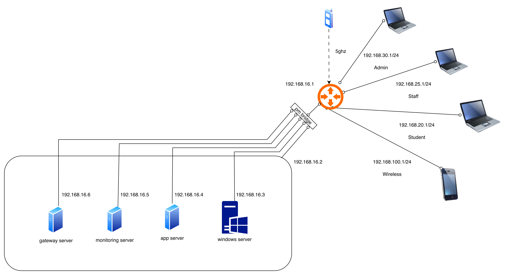

# Topology

Tipologi jaringan Learnova menggunakan arsitektur sederhana dengan proxmox untuk menjalankan semua system virtualisasi, **windows server, app server, etc**

<figure><figcaption></figcaption></figure>

### Jaringan Utama

* **Router:** `192.168.16.1`
* **Proxmox:** `192.168.16.2`

### Segmentasi Jaringan Client (DHCP)

#### Jaringan Client Wireless (2.4 GHz)

* Network: 192.168.100.0/24
* Gateway: 192.168.100.1
* IP Address: DHCP (otomatis)
* Media: Wi-Fi 2.4 GHz

#### Jaringan Client Student

* Network: `192.168.20.0/24`
* Gateway: `192.168.20.1`
* IP Address: DHCP (otomatis)
* Media: LAN

#### Jaringan Client Staff

* Network: `192.168.25.0/24`
* Gateway: `192.168.25.1`
* IP Address: DHCP (otomatis)
* Media: LAN

#### Jaringan Client Admin

* Network: `192.168.30.0/24`
* Gateway: `192.168.30.1`
* IP Address: DHCP (otomatis)
* Media: LAN

### Server Virtual pada Proxmox

<table><thead><tr><th>Server</th><th width="166.0078125">Sistem Operasi</th><th>IP Address</th><th>SSH Port</th><th>Fungsi Utama</th></tr></thead><tbody><tr><td>Windows Server</td><td>Windows Server</td><td><code>192.168.16.3</code></td><td>-</td><td>Domain Controller &#x26; GPO</td></tr><tr><td>Ubuntu App Server</td><td>Ubuntu Server</td><td><code>192.168.16.4</code></td><td>1604</td><td>Nextcloud dan Landing Page</td></tr><tr><td>Ubuntu Monitoring Server</td><td>Ubuntu Server</td><td><code>192.168.16.5</code></td><td>1605</td><td>Grafana &#x26; Prometheus</td></tr><tr><td>Ubuntu Gateway Server</td><td>Ubuntu Server</td><td><code>192.168.16.6</code></td><td>1606</td><td>Cloudflared Ingress</td></tr><tr><td>Ubuntu BTest Server</td><td>Ubuntu Server</td><td><code>192.168.16.7</code></td><td>-</td><td>Bandwith Speed Test</td></tr></tbody></table>
